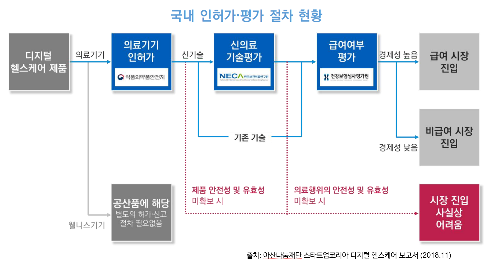
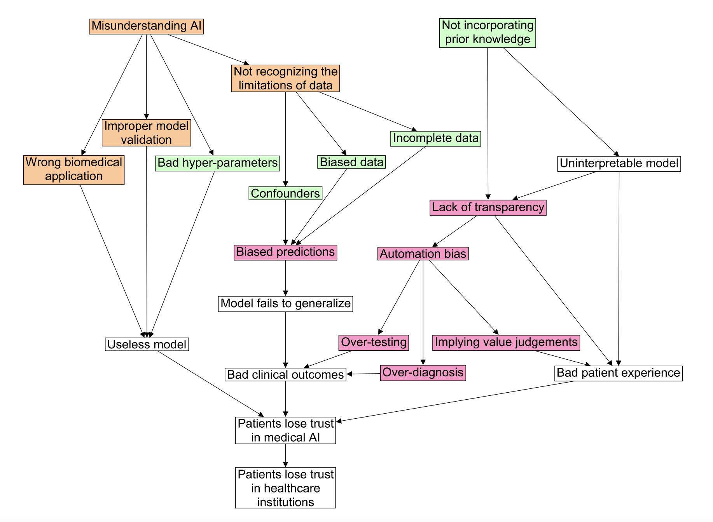

# 2021/04/22 - Agenda (KST PM 10:00 ~ PM 11:30)

“클생과 현생의 불일치”를 목표로 하는 고품격 의료 인공지능 주제 만담을 시작해봅니다. 

* [Clubhouse 2021/04/22 이벤트로 바로가기](https://www.joinclubhouse.com/event/PGX53Nlb)

## 1. 스피커 소개 (각 1분 미만)
### Moderator : 전종홍
### Speaker : 김휘영, 김진성, 하정우, 권인호, 윤주흥, 황보율 
### Invited Speaker : 신수용(성균관대), 최정필(코어라인소프트)
* 소속 기관/학회
* 하고 계시는 일/관심 연구 주제
* 홍보나 리쿠르팅 하실 내용 등등
* 자랑하실 내용, 심지어 장기자랑도 가능^^

## 2. 기존 만남기록 
* 2021/03/25 - [1st agenda : EP01 - 첫만담](/20210325-1st-agenda.md)
* 2021/04/01 - [2nd agenda : EP02 - 만우절 특집 - 2035년 전망](/20210401-2nd-agenda.md)
* 2021/04/08 - [3rd agenda : EP03 - 클친소 특집](/20210408-3rd-agenda.md)
* 2021/04/15 - [4th agenda : EP04 - 데이터 증강과 합성](/20210415-4th-agenda.md)

## 3. 주제토론: 11시까지 (가능한 범위까지만 하고 차주로 넘깁니다. 스피커들과 협의 과정에서 변경될 수 있습니다)

### 추가했으면 하는 주제나 안건이 있으면 언제든 github/email/기타 DM 등을 이용해 이슈나 코멘트로 남겨주세요. 

1. 투자/경제/주식 관련 이슈 

2. 인공지능 기반 의료기기 성능 평가 가이드라인 개발 
   * 개요 소개 : 대한의료인공지능학회 (KoSAIM), 대한영상의학회 임상연구네트워크 (KSR; RINK-CR) 
   * 참고자료: 식약처 가이드라인
      * [빅데이터 및 인공지능 기술이 적용된 의료기기 허가심사 가이드라인(민원인 안내서)-2019](http://www.nifds.go.kr/brd/m_15/view.do?seq=12743)
      * [인공지능 기반 의료기기의 임상 유효성 평가 가이드라인(민원인 안내서)-2019](http://www.nifds.go.kr/brd/m_15/view.do?seq=12744)
      * [대장암 영상검출·진단보조 소프트웨어 안전성·성능 및 임상시험계획서 평가 가이드라인(민원인 안내서)-2020](http://www.nifds.go.kr/brd/m_15/view.do?seq=12931)
      * [뇌 영상검출·진단보조 소프트웨어 안전성·성능 및 임상시험계획서 평가 가이드라인(민원인 안내서)-2020](http://www.nifds.go.kr/brd/m_15/view.do?seq=12929)
      * [전립선암 영상검출·진단보조 소프트웨어 안전성·성능 및 임상시험계획서 평가 가이드라인(민원인 안내서)-2020](http://www.nifds.go.kr/brd/m_15/view.do?seq=12930)
      * [관상동맥협착 대상 임상의사결정지원시스템(CDSS) 의료기기 임상시험계획서 작성 가이드라인(민원인 안내서)-2019](http://www.nifds.go.kr/brd/m_15/view.do?seq=12740)
      * [허혈성 뇌졸중 대상 임상의사결정지원시스템(CDSS) 의료기기 임상시험계획서 작성 가이드라인(민원인 안내서)-2019](http://www.nifds.go.kr/brd/m_15/view.do?seq=12739)
      * [폐암, 폐결절 대상 임상의사결정지원시스템(CDSS) 의료기기 임상시험계획서 작성 가이드라인(민원인 안내서)-2019](http://www.nifds.go.kr/brd/m_15/view.do?seq=12742)
      * [유방암 대상 임상의사결정지원시스템(CDSS) 의료기기 임상시험계획서 작성 가이드라인(민원인 안내서)-2019](http://www.nifds.go.kr/brd/m_15/view.do?seq=12741)
   * 참고자료: 건강보험심사평가원 가이드라인
      * [AI기반 의료기술(병리학 분야)의 급여 평가 가이드라인 마련 연구-2019](http://repository.hira.or.kr/handle/2019.oak/2267)
      * [AI기반 의료기술(영상의학 분야)의 급여여부 평가 가이드라인 마련 연구-2019](http://repository.hira.or.kr/handle/2019.oak/764)
      * [혁신적 의료기술의 요양급여 여부 평가 가이드라인-AI기반 의료기술(영상의학분야) & 3D 프린팅 이용 의료기술-2019](https://www.korea.kr/archive/expDocView.do?docId=38853)
      * [혁신적 의료기술의 요양급여 여부 평가 가이드라인_AI 기반 병리학분야 의료기술-2020](https://www.hira.or.kr/bbsDummy.do?pgmid=HIRAA020041000100&brdScnBltNo=4&brdBltNo=10255&pageIndex=1)
   * 참고자료: 유관학회 가이드라인
      * [대한병리학회-디지털 병리 가이드라인 권고안-2020](https://www.jpatholtm.org/upload/media/jptm-2020-08-27-suppl1.pdf)
   * 참고자료: 해외 
      * [FDA-Artificial Intelligence/Machine Learning (AI/ML)-Based Software as a Medical Device (SaMD) Action Plan](https://www.fda.gov/news-events/press-announcements/fda-releases-artificial-intelligencemachine-learning-action-plan)
      * [AMIA Position Paper Details Policy Framework For AI/ML-Driven Decision Support](https://www.amia.org/news-and-publications/press-release/amia-position-paper-details-policy-framework-aiml-driven-decision) 

4. 최근에 개인적으로 가장 임팩트가 있었다고 생각하시는 의료 인공지능 관련  뉴스나 논문, 연구주제 등에서 하나를 꼽아 보신다면 ? (스피커들이 뽑아오신 뉴스를 소개) 
   * [한국-미국 인공지능(AI) 기술 격차 1.8년…수년째 이어지는 이유는?](https://www.itbiznews.com/news/articleView.html?idxno=35103)
   * [의료 분야 AI 기업, 의료산업 첨단화 이끈다](http://www.irobotnews.com/news/articleView.html?idxno=24637)
   * [코어라인소프트, '아주대학교의료원'과 MOU 체결](https://news.mt.co.kr/mtview.php?no=2021042010505718386)
   * [세계 100대 AI 스타트업 없는 한국…“유니콘 육성해야”](https://www.donga.com/news/Economy/article/all/20210405/106244510/1)
   * [Are Medical AI Devices Evaluated Appropriately?](https://hai.stanford.edu/news/are-medical-ai-devices-evaluated-appropriately)
   * [EU 집행위 'AI 규제안' 제안..."위험한 AI 사용 금지"](https://www.ytn.co.kr/_ln/0104_202104221317535550)
      * [Health-related data sharing을 위해 GDPR이 요구하는 10가지 사항](https://sooyongshin.wordpress.com/2018/10/15/health-related-data-sharing%EC%9D%84-%EC%9C%84%ED%95%B4-gdpr%EC%9D%B4-%EC%9A%94%EA%B5%AC%ED%95%98%EB%8A%94-10%EA%B0%80%EC%A7%80-%EC%82%AC%ED%95%AD/)
      * [코로나19로 EU 데이터 보호규정 및 AI 준비의 한계 노출](https://library.etri.re.kr/service/data/etri-insight/down.htm;jsessionid=7991B0000C98A2D82DB0716005973A34?id=778)
   * [Proposal for a Regulation on a European approach for Artificial Intelligence](https://digital-strategy.ec.europa.eu/en/library/proposal-regulation-european-approach-artificial-intelligence)

5. Special Talk : 의료 인공지능의 단점, 위험, 그리고 한계 (부제: 과연 의료 인공지능 비즈니스로 돈벌 수 있을까? 시장과 비즈니스를 키우기 위해 필요한 것은?)
   * [“AI, 의료 대체 아닌 증강 방향으로 나아가야”](https://www.sciencetimes.co.kr/news/ai-%EC%9D%98%EB%A3%8C-%EB%8C%80%EC%B2%B4-%EC%95%84%EB%8B%8C-%EC%A6%9D%EA%B0%95-%EB%B0%A9%ED%96%A5%EC%9C%BC%EB%A1%9C-%EB%82%98%EC%95%84%EA%B0%80%EC%95%BC/) 
   * [의료 AI의 현재와 미래](https://hineca.kr/1868)
   * [의료분야 인공지능 활용 현황과 미래 전망’ 논의](https://kast.tistory.com/985) - [제38차 한림국제심포지움](https://event-us.kr/kast/event/24385)
   * [2021년 제1차 보건의료데이터 혁신포럼(4.22)](https://www.k-his.or.kr/board.es?mid=a10309000000&bid=0025) 
   * 이슈1 - 건강보험 수가 및 수익 모델 
      * [AI 의료기기 허가는 '36건', 건보 적용은 '0건'](https://www.wowtv.co.kr/NewsCenter/News/Read?articleId=A202008100289)
      * [Digital Health (5) – 수가](https://sooyongshin.wordpress.com/2019/12/28/digital-health-5-%EC%88%98%EA%B0%80/)
      * [Top medical device companies are investing in AI](https://www.medicaldevice-network.com/comment/medical-device-companies-ai/)
      * [Top 121 Startups developing AI for Medicine and Healthcare](https://www.ai-startups.org/top/medicine/)
        

   * 이슈2 - 인허가 및 규제 프레임워크 
      * [뷰노, 국내 1호 식약처 ‘혁신의료기기소프트웨어 제조기업 인증’ 획득](http://www.biotimes.co.kr/news/articleView.html?idxno=5719)
      * [인공지능(AI) 적용 의료기기 53건 허가](http://www.hitnews.co.kr/news/articleView.html?idxno=19712)
      * [AI/ML-Enabled Medical Devices — 4 Keys To Obtain Global Regulatory Approval](https://www.meddeviceonline.com/doc/ai-ml-enabled-medical-devices-keys-to-obtain-global-regulatory-approval-0001)
   * 이슈3 - 기술 및 성능
      * [How medical AI devices are evaluated: limitations and recommendations from an analysis of FDA approvals](https://www.nature.com/articles/s41591-021-01312-x.epdf?sharing_token=8BNOnt1UUOf0iPsJ9yU0J9RgN0jAjWel9jnR3ZoTv0M6PlZXWQqbgCrdZtSbNOnPDQlhZJ-fPz8LJ4JqCoxGYshqBh62049hIhMSEfJaE7pKaceG00AD1FUBHLZ5YShokEBQWoF6kBbZitEELPDqWu-9esaFE8DcbdQ1QAgRChw%3D&utm_source=STAT+Newsletters&utm_campaign=fdec4d0d0d-health_tech_4-6-21_COPY_01&utm_medium=email&utm_term=0_8cab1d7961-fdec4d0d0d-152708089) - Nature
      * [“AI의료, ‘99% 정확도’ 보다 중요한 것이 있다”](https://byline.network/2020/10/29-84/)
      * [인공지능(AI)은 의료진단 분야를 어떻게 바꿀까](http://www.prolog.kr/news/articleView.html?idxno=503)
      * [Opinion: AI Could Aid Cancer Diagnosis, but Caution Is Needed](https://www.the-scientist.com/critic-at-large/opinion-ai-could-aid-cancer-diagnosis-but-caution-is-needed-68584)
      * [AI Adoption in Healthcare: 10 Pros and Cons](https://www.byteant.com/blog/ai-adoption-in-healthcare-10-pros-and-cons/)
      * [Artificial Intelligence in Medicine – Part 3: Is There a Downside to AI in Medicine?](http://sperlingmedicalgroup.com/downsides-to-artificial-intelligence-in-medicine/)
      * [Artificial Intelligence for COVID-19: Rapid Review](https://www.jmir.org/2020/10/e21476/)
   * 이슈4 - 신뢰
      * [Artificial Intelligence and Human Trust in Healthcare: Focus on Clinicians](https://www.ncbi.nlm.nih.gov/pmc/articles/PMC7334754/)
      * [Trust and medical AI: the challenges we face and the expertise needed to overcome them](https://pubmed.ncbi.nlm.nih.gov/33340404/) - [arXiv PDF](https://arxiv.org/abs/2008.07734)
        

      * [4 Barriers to Adopting Artificial Intelligence in Healthcare and How to Overcome Them](https://healthcareweekly.com/4-barriers-to-adopting-artificial-intelligence-in-healthcare/)
      * [Google’s medical AI was super accurate in a lab. Real life was a different story](https://www.technologyreview.com/2020/04/27/1000658/google-medical-ai-accurate-lab-real-life-clinic-covid-diabetes-retina-disease/)
   * 이슈5 - 법적/윤리적 
      * [의료 AI 잘 쓰려면 법적 문제 해결해야](http://www.medup.co.kr/news/articleView.html?idxno=130)
      * [Ethical and legal challenges of artificial intelligence-driven healthcare](https://www.ncbi.nlm.nih.gov/pmc/articles/PMC7332220/)
      * [인공지능 시대를 준비하는 법·제도·규제 정비 로드맵 마련](https://www.msit.go.kr/bbs/view.do?sCode=user&mId=113&mPid=112&bbsSeqNo=94&nttSeqNo=3179749) 
      * [Top Ten Legal Considerations for Use and/or Development of Artificial Intelligence in Health Care](https://www.natlawreview.com/article/top-ten-legal-considerations-use-andor-development-artificial-intelligence-health)

6. 특별 주제  
   * [의료/ 헬스케어 분야에서의 설명 가능 인공지능(Explainable AI) 연구 동향](https://www.bioin.or.kr/board.do?cmd=view&bid=tech&num=305909)
   * [A Survey on Explainable Artificial Intelligence (XAI): Toward Medical XAI](https://ieeexplore.ieee.org/abstract/document/9233366)

4. 스피드 퀴즈: 찍먹/부먹 논쟁, 짜장/짬뽕, 민초파/반민초파 논쟁~ 
   * 장비빨/데이터빨/인재빨 중 어느게 더 중요하다고 보십니까 ? 
   
5. 의료 인공지능을 통해 실제 의사, 환자가 편해지고 있는가 ? 
   * 실제 현실적 적용/활용 현황이나 도움을 받는 비율은 얼마나 되고 있다고 생각하십니까 ?       
 
6. AI 전문가 확보와 몸값 상승이 비상인데, 의료 인공지능 전문가의 몸값 상승도 진행되고 있는가 ?

7. 의료 인공지능 전문가가 될 수 있나 ? 기본적으로 가져야 할 요건들은 ? 인적 교류는 활발한 편인가 ? 의료 용어를 몰라도 할 수 있나 ?

8. 의료 인공지능에서의 윤리 이슈는 잘 검토되고 있다고 보시는지 ? 이루다 사태

## 4, 자유토론 및 질의응답: 11시30분까지

누구든 자유롭게 발언 신청하고 질문을 해주시면 됩니다. 

추가/수정/발언 참석 원하시는 분들은 [아젠다 이슈](https://github.com/hollobit/AIML-in-Medicine-club/issues/6)에 적어주시면 됩니다. 
